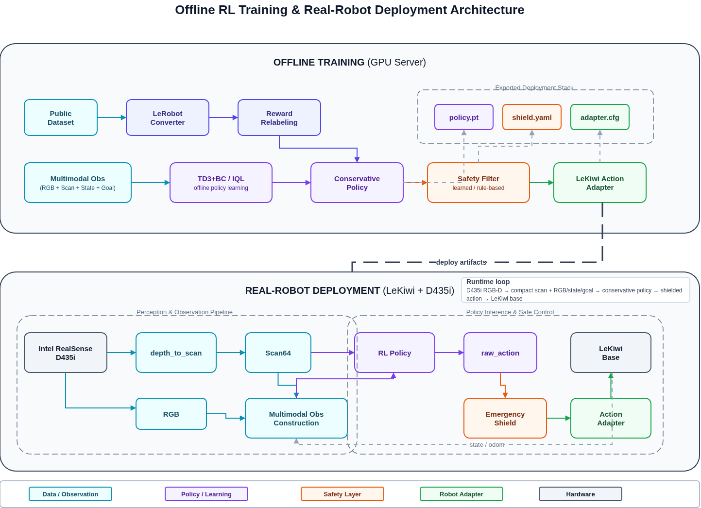

# Master's Thesis Project Plan

## Multimodal Offline Reinforcement Learning for Safe Navigation of Low-Cost Mobile Robots from Public Visual Navigation Datasets

---

## Part 1: Project Repositioning — Old Project → Deployment Stack

### Old Project: `lekiwi_rgbd_sim2real_agv`

The existing codebase contains:
- Intel RealSense D435i RGB-D camera driver (`perception/realsense_reader.py`)
- Depth image → Scan64 virtual LiDAR projection (`perception/depth_to_scan.py`)
- ZMQ host/client communication (`communication/host.py`, `communication/client.py`)
- LeKiwi action sending (via LeRobot robot abstraction)
- Emergency Safety Shield (`control/emergency_shield.py`)
- Action Adapter (`control/action_adapter.py`)
- DWA traditional navigation policy (`control/dwa_policy.py`)
- Residual safety model (small MLP) (`learning/residual_model.py`)
- Perception modules: YOLO, ArUco, obstacle detector, depth preprocess
- Synthetic RGB-D rendering (`sim/synthetic_rgbd/`)
- MuJoCo LeKiwi env placeholder (`sim/lekiwi_envs/`)
- Dataset recording (`communication/dataset_writer.py`)

### New Positioning: LeKiwi RGB-D Deployment Stack

The old project is **repositioned** as the **real-robot deployment and perception backbone** of the new thesis. It is NOT the main algorithmic contribution. Its roles:

| Module | Role in New Thesis |
|--------|-------------------|
| `perception/realsense_reader.py` | RGB-D perception interface — captures 640x480 RGB + depth from D435i |
| `perception/depth_to_scan.py` | Scan64 projection — converts depth image to 64-beam polar scan for safety and RL input |
| `perception/depth_preprocess.py` | Depth hole-filling, median filtering, temporal smoothing |
| `communication/host.py` | On-robot ZMQ server — streams observations, receives commands |
| `communication/client.py` | Off-board ZMQ client — sends RL policy actions to robot |
| `control/emergency_shield.py` | Hard safety layer — emergency stop, slowdown, lateral inhibit |
| `control/action_adapter.py` | Action post-processing — clipping, acceleration limit, EMA smoothing |
| `control/dwa_policy.py` | Traditional baseline — DWA for differential/omni drive |
| `communication/dataset_writer.py` | LeRobot-format dataset recording for real-robot logs |

### What the Old Project is NOT in the New Thesis

- **NOT the main algorithm** — offline RL is the main contribution
- **NOT the training data source** — public datasets provide training data
- **NOT assumed to have massive real data** — only small-scale validation (5–10 episodes)

### Architecture Diagram



---

## Part 2: Project Naming

### English Project Name Candidates

1. **`lekiwi_public_offline_nav_rl`** — emphasizes public data + offline RL for navigation
2. **`lekiwi_multimodal_safe_nav`** — emphasizes multimodal fusion + safety
3. **`public_data_safe_nav_rl`** — emphasizes the public-data-driven paradigm
4. **`lerobot_multimodal_offline_nav`** — ties to LeRobot ecosystem
5. **`lekiwi_omniguard_rl`** — concise brand name: omni-directional + guard + RL

**Recommended**: `lekiwi_public_offline_nav_rl` — clearest about the contribution axis.

### Chinese Thesis Title Candidates

1. **《基于公开视觉导航数据的低成本移动机器人多模态离线强化学习安全导航方法研究》**
   (Multimodal Offline RL Safe Navigation for Low-Cost Mobile Robots Using Public Visual Navigation Datasets)
   — 最全面，推荐

2. **《面向低成本全向移动机器人的多模态离线强化学习安全导航研究》**
   (Multimodal Offline RL Safe Navigation for Low-Cost Omnidirectional Mobile Robots)

3. **《融合RGB-D与激光雷达表示的移动机器人离线强化学习导航方法》**
   (Offline RL Navigation Method Integrating RGB-D and LiDAR Representations for Mobile Robots)

4. **《基于LeRobot平台的公开数据驱动移动机器人安全导航研究》**
   (Public-Data-Driven Safe Navigation for Mobile Robots Based on the LeRobot Platform)

5. **《从公开数据集到真实机器人：多模态保守离线强化学习导航方法》**
   (From Public Datasets to Real Robots: Multimodal Conservative Offline RL Navigation)

**Recommended**: #1 — it covers all keywords: public data, low-cost robot, multimodal, offline RL, safe navigation.

---

## Part 3: Complete Project Directory Structure

```
lekiwi_public_offline_nav_rl/
│
├── README.md                          # Project overview, install, usage
├── setup.py                           # Package installation (pip install -e .)
├── pyproject.toml                     # Modern build config
├── requirements.txt                   # Core dependencies
├── requirements_dev.txt               # Dev dependencies (lint, test)
│
├── configs/                           # YAML/JSON configuration files
│   ├── default.yaml                   # Default training config
│   ├── td3bc_config.yaml              # TD3+BC hyperparameters
│   ├── iql_config.yaml                # IQL hyperparameters
│   ├── cql_config.yaml                # CQL hyperparameters
│   ├── dataset_config.yaml            # Dataset paths, preprocessing params
│   ├── model_config.yaml              # Encoder/network architecture
│   ├── safety_config.yaml             # Safety filter parameters
│   ├── lekiwi_config.yaml             # LeKiwi deployment config
│   └── eval_config.yaml               # Evaluation config
│
├── data_adapters/                     # Public dataset → unified format
│   ├── __init__.py
│   ├── base_adapter.py                # Abstract base class for all adapters
│   ├── gnm_adapter.py                 # GNM / ViNT / NoMaD dataset adapter
│   ├── habitat_adapter.py             # Habitat / RoboTHOR dataset adapter
│   ├── replay_buffer_adapter.py       # Generic replay buffer (h5py/npz) adapter
│   ├── observation_normalizer.py      # Fit & apply observation normalization stats
│   └── data_splitter.py               # Train/val/test split with trajectory awareness
│
├── lerobot_conversion/                # Convert unified format → LeRobotDataset
│   ├── __init__.py
│   ├── unified_to_lerobot.py          # Main converter: unified dict → LeRobotDataset
│   ├── le robot_schema.py             # Define observation/action space schema
│   ├── video_encoder.py               # Encode RGB frames to LeRobot video format
│   ├── metadata_writer.py             # Write dataset metadata, stats, info.json
│   └── validate_dataset.py            # Validate converted dataset integrity
│
├── reward/                            # Reward relabeling module
│   ├── __init__.py
│   ├── reward_calculator.py           # Core reward function: progress, safety, smoothness
│   ├── progress_estimator.py          # Estimate goal progress from trajectory
│   ├── collision_detector.py          # Detect collisions from Scan64 / depth
│   ├── intervention_labeler.py        # Label human intervention timesteps
│   ├── goal_conditioned_reward.py     # Goal-conditioned reward variants
│   └── reward_normalizer.py           # Normalize rewards across episodes
│
├── models/                            # Multimodal neural network modules
│   ├── __init__.py
│   ├── rgb_encoder.py                 # ResNet-18/34 CNN for RGB encoding
│   ├── scan_encoder.py                # 1D-CNN or MLP for Scan64 encoding
│   ├── state_encoder.py               # MLP for robot state (velocity, pose)
│   ├── goal_encoder.py                # MLP for goal vector encoding
│   ├── action_history_encoder.py      # Optional: LSTM/Transformer for action history
│   ├── fusion_module.py               # Multimodal fusion (concat + MLP, or cross-attention)
│   ├── actor_network.py               # Policy network: fusion → action [vx, vy, omega]
│   ├── critic_network.py              # Q-network(s): fusion + action → Q-value
│   ├── risk_head.py                   # Optional: predict collision probability
│   ├── ensemble_critic.py             # Ensemble of critics for uncertainty estimation
│   └── model_factory.py               # Build model from config
│
├── rl/                                # Offline RL algorithms
│   ├── __init__.py
│   ├── base_offline_rl.py             # Abstract base class for offline RL
│   ├── td3bc.py                       # TD3+BC implementation
│   ├── iql.py                         # IQL (Implicit Q-Learning) implementation
│   ├── cql.py                         # CQL (Conservative Q-Learning) implementation
│   ├── replay_buffer.py               # Offline replay buffer with multimodal obs
│   ├── q_value_monitor.py             # Monitor Q-value distribution during training
│   └── policy_saver.py                # Save/load policy checkpoints
│
├── safety/                            # Safety filter and shielding
│   ├── __init__.py
│   ├── safety_filter.py               # Main safety filter orchestrator
│   ├── collision_risk_estimator.py    # Estimate collision risk from Scan64
│   ├── velocity_scaler.py             # Scale velocity based on obstacle distance
│   ├── acceleration_limiter.py        # Hard acceleration constraints
│   ├── low_pass_filter.py             # Temporal action smoothing
│   ├── invalid_depth_handler.py       # Fallback when depth is invalid
│   ├── timeout_handler.py             # Communication timeout fallback
│   └── safety_config.py               # Safety dataclass configuration
│
├── lekiwi_deployment/                 # LeKiwi real-robot deployment adapter
│   ├── __init__.py
│   ├── lekiwi_action_adapter.py       # Convert RL action → LeKiwi command format
│   ├── observation_assembler.py       # Assemble multimodal obs from real sensors
│   ├── scan64_projector.py            # Real-time depth → Scan64 on LeKiwi
│   ├── latency_monitor.py             # Measure inference + communication latency
│   └── deployment_runner.py           # Main deployment loop on LeKiwi
│
├── baselines/                         # Baseline methods
│   ├── __init__.py
│   ├── behavior_cloning.py            # BC baseline (MSE loss on actions)
│   ├── dwa_baseline.py                # DWA traditional planner wrapper
│   ├── td3bc_no_fusion.py             # TD3+BC without multimodal fusion (ablation)
│   ├── iql_no_safety.py               # IQL without safety filter (ablation)
│   └── ours_full.py                   # Our full method entry point
│
├── eval/                              # Evaluation and metrics
│   ├── __init__.py
│   ├── offline_evaluator.py           # Offline evaluation on held-out data
│   ├── online_evaluator.py            # Online evaluation in simulation (if available)
│   ├── real_robot_evaluator.py        # Small real-robot validation
│   ├── metrics.py                     # All metrics: return, success, collision, smoothness
│   ├── trajectory_analyzer.py         # Trajectory-level analysis
│   ├── ablation_reporter.py           # Generate ablation study tables
│   ├── latency_benchmark.py           # Inference latency benchmark
│   └── plot_utils.py                  # Visualization utilities
│
├── scripts/                           # Entry-point scripts
│   ├── download_public_data.sh        # Download public datasets
│   ├── convert_to_lerobot.py          # Convert public data → LeRobot format
│   ├── relabel_rewards.py             # Run reward relabeling
│   ├── train_td3bc.py                 # Train TD3+BC
│   ├── train_iql.py                   # Train IQL
│   ├── train_bc.py                    # Train BC baseline
│   ├── evaluate_offline.py            # Run offline evaluation
│   ├── run_lekiwi_deployment.py       # Deploy on real LeKiwi
│   ├── run_real_validation.py         # Small real-robot validation
│   ├── generate_paper_figures.py      # Generate paper figures and tables
│   └── benchmark_latency.py           # Latency benchmark script
│
├── paper/                             # Thesis-related documents
│   ├── THESIS_PLAN.md                 # This planning document
│   ├── figures/                       # Paper figures
│   ├── tables/                        # Result tables
│   └── references.bib                 # Bibliography
│
├── tests/                             # Unit tests
│   ├── test_data_adapter.py
│   ├── test_reward.py
│   ├── test_safety_filter.py
│   ├── test_models.py
│   └── test_rl.py
│
└── notebooks/                         # Exploratory notebooks
    ├── explore_public_dataset.ipynb
    ├── visualize_rewards.ipynb
    └── analyze_results.ipynb
```

---

## Part 4: Technical Pipeline

### Complete Pipeline

```
Step 1: Public Navigation Dataset
  Input:  Raw public dataset (e.g., GNM trajectory h5 files, Habitat episodes)
  Output: Unified dict format {obs, action, next_obs, done, info}

Step 2: LeRobot-Compatible Conversion
  Input:  Unified dict format
  Output: LeRobotDataset (HuggingFace datasets-compatible)
  Key functions:
    - unified_to_lerobot.py: convert_episode()
    - lerobot_schema.py: define spaces
    - video_encoder.py: encode_frames()

Step 3: Reward Relabeling
  Input:  LeRobotDataset (no reward or sparse reward)
  Output: LeRobotDataset with dense reward field
  Key functions:
    - reward_calculator.py: compute_reward()
    - progress_estimator.py: estimate_progress()
    - collision_detector.py: detect_collision()

Step 4: Multimodal Observation Construction
  Input:  LeRobotDataset (RGB, depth, state, goal)
  Output: Training-ready multimodal tensors
  Data fields:
    - rgb: (T, 3, H, W) normalized [0,1]
    - depth: (T, 1, H, W) or scan64: (T, 64) in meters
    - state: (T, 3) [vx, vy, omega]
    - goal: (T, 3) [dx, dy, dtheta] in robot frame
    - prev_action: (T, 3) [vx_prev, vy_prev, omega_prev]
  Key functions:
    - observation_assembler.py: build_observation(), compute_scan64_from_depth()

Step 5: Offline RL Training
  Input:  Multimodal obs + relabeled rewards
  Output: Trained policy network (actor)
  Algorithms: TD3+BC, IQL, CQL
  Key functions:
    - td3bc.py: train_step(), update_actor(), update_critic()
    - iql.py: train_step(), update_q(), update_v(), update_policy()
  Training loop:
    for epoch in range(num_epochs):
        batch = replay_buffer.sample(batch_size)
        obs = encode_multimodal(batch)
        loss = offline_rl.update(obs, batch.actions, batch.rewards, batch.next_obs, batch.dones)

Step 6: Safety Filter
  Input:  RL policy action + Scan64 + obstacle distance
  Output: Safe action (possibly modified)
  Key functions:
    - safety_filter.py: filter_action()
    - emergency_stop(): vx=0 if front_min < stop_distance
    - velocity_scale(): scale vx proportional to clearance
    - action_clip(): clip to [v_min, v_max]
    - acceleration_limit(): |a_t - a_{t-1}| <= max_accel * dt
    - low_pass_smooth(): EMA between consecutive actions
    - invalid_depth_fallback(): fallback to safe stop if depth invalid
    - timeout_fallback(): zero velocity if communication lost

Step 7: LeKiwi Deployment Adapter
  Input:  Safe action [vx, vy, omega]
  Output: LeKiwi motor command
  Key functions:
    - lekiwi_action_adapter.py: adapt_action()
    - Convert coordinate frame if needed
    - Apply LeKiwi-specific velocity limits
    - Send via ZMQ to LeKiwi host

Step 8: Offline Evaluation + Small Real-Robot Validation
  Offline:
    - Evaluate on held-out trajectories
    - Metrics: return, success proxy, collision risk, Q-values
  Real-Robot:
    - 5-10 scenarios: static obstacle, narrow passage, dynamic pedestrian
    - Metrics: success rate, collision rate, emergency stop count, latency
```

### Data Fields Throughout the Pipeline

| Stage | RGB | Depth | Scan64 | State | Goal | Action | Reward | Done |
|-------|-----|-------|--------|-------|------|--------|--------|------|
| Public Dataset (raw) | ✓ | partial | ✗ | partial | partial | ✓ | ✗/sparse | partial |
| Unified Format | ✓ | ✓/computed | ✓ | ✓ | ✓ | ✓ | ✗ | ✓ |
| LeRobotDataset | ✓ | ✓ | ✓ | ✓ | ✓ | ✓ | ✓ (relabeled) | ✓ |
| Training Batch | tensor | tensor | tensor | tensor | tensor | tensor | tensor | tensor |
| Real-robot Deploy | ✓ (D435i) | ✓ (D435i) | ✓ (computed) | ✓ (odom) | ✓ (planned) | — | — | — |

---

## Part 5: Public Dataset Selection

### 5.1 GNM / ViNT / NoMaD / ReViND Series

| Dataset | Modality | Scale | Goal-Conditioned | Suitability |
|---------|----------|-------|------------------|-------------|
| **GNM** (GNM dataset) | RGB + action | ~60h driving | Implicit (image goal) | ★★★★☆ — Good for main training |
| **ViNT** (Visual Navigation Transformer) | RGB + action | varies | Yes (image + GPS) | ★★★★☆ — Strong for goal-conditioned |
| **NoMaD** (Navigation with Multimodal Diffusion) | RGB + action + depth (partial) | ~40h | Yes | ★★★☆☆ — Some depth, but diffusion-focused |
| **ReViND** | RGB + action | medium | Yes | ★★★☆☆ — Smaller scale |

**Recommendation**: 
- **GNM or ViNT** as **main training data** — large scale, RGB + action, diverse environments
- **NoMaD** as **supplementary** — provides some depth data for Scan64 validation
- Limitation: these datasets may lack depth images → need to compute Scan64 from depth, or use monocular depth estimation as proxy
- If no depth: use **monocular depth estimation** (e.g., DepthAnything v2) offline to generate pseudo-depth, then compute Scan64

### 5.2 Habitat / RoboTHOR RGB-D Embodied Navigation

| Dataset/Benchmark | Modality | Scale | Goal-Conditioned | Suitability |
|-------------------|----------|-------|------------------|-------------|
| **Habitat Matterport3D** | RGB-D + pose + action | Very large | Yes | ★★★★★ — **Best choice for main training** |
| **RoboTHOR** | RGB-D + pose + action | Medium | Yes | ★★★★☆ — Good for structured indoor |
| **Habitat Gibson** | RGB-D + pose + action | Large | Yes | ★★★★☆ — Diverse homes |
| **HM3D-Sem** | RGB-D + semantic | Large | Yes (semantic goal) | ★★★☆☆ — Semantic goal, more complex |

**Recommendation**:
- **Habitat** as **primary training data** — provides RGB-D, pose, action, goal, done signal
  - RGB-D → we can directly compute Scan64
  - Goal position available → goal-conditioned RL
  - Done signal → automatic success/collision labeling
- **RoboTHOR** as **evaluation benchmark** — standardized evaluation protocol

### 5.3 Other Public Mobile Robot Navigation Datasets

| Dataset | Description | Suitability |
|---------|-------------|-------------|
| **SCAND** | Socially-aware navigation | ★★★☆☆ — Good for dynamic obstacle scenarios |
| **TurtleBot datasets** | Various TurtleBot navigation logs | ★★☆☆☆ — Small scale, specific to TurtleBot |
| **ROS Navigation logs** | Community-collected navigation data | ★★☆☆☆ — Format varies, quality uncertain |
| **iGibson** | Interactive Gibson env | ★★★☆☆ — Interactive, but more simulation-heavy |

### 5.4 LeRobot / HuggingFace Robot Datasets

| Dataset | Description | Suitability |
|---------|-------------|-------------|
| **lerobot/pusht** | Push-T task | ✗ — Manipulation, not navigation |
| **lerobot/aloha_*** | Bimanual manipulation | ✗ — Not navigation |
| **lerobot/umi_*** | UMI manipulation | ✗ — Not navigation |
| **lerobot/dora_*** | DORA navigation (if exists) | ★★★★☆ — Navigation-specific |
| **lerobot/lekiwi_*** | LeKiwi teleop data | ★★★☆☆ — Format test / small validation |

**Recommendation**:
- **Habitat RGB-D data** → **primary training data** (convert to LeRobot format)
- **GNM/ViNT** → **supplementary** (large scale, diverse real-world driving)
- **LeRobot datasets** → **format validation** (ensure our converter works with LeRobot ecosystem)
- **RoboTHOR** → **offline evaluation benchmark**
- **Self-collected LeKiwi teleop** → **real-robot sanity check only** (5–10 episodes, NOT main training)

### Priority Order

```
Primary:   Habitat Matterport3D/HM3D (RGB-D, goal-conditioned, large scale)
Secondary: GNM/ViNT (real-world driving diversity)
Tertiary:  RoboTHOR (structured evaluation)
Test:      LeRobot public datasets (format compatibility)
Own data:  LeKiwi teleop 5-10 episodes (real-robot validation only)
```

---

## Part 6: Algorithm Design — Multimodal Offline RL

### 6.1 Input / Output Specification

**Input (observation space):**
```
obs = {
    rgb:        (3, 224, 224)  # RGB image, normalized
    scan64:     (64,)          # Depth-derived polar scan, meters
    state:      (3,)           # [vx, vy, omega] current velocity
    goal:       (3,)           # [dx, dy, dtheta] goal in robot frame
    prev_action:(3,)           # [vx, vy, omega] previous action (optional)
}
```

**Output (action space):**
```
action = [vx, vy, omega]  # continuous, for LeKiwi omni base
# vx ∈ [-0.3, 0.3] m/s
# vy ∈ [-0.3, 0.3] m/s
# omega ∈ [-90, 90] deg/s
```

### 6.2 Model Architecture

```
                           ┌─────────────────┐
          RGB (3,224,224)─→│  ResNet-18      │──→ rgb_feat (512,)
                           │  (pretrained)    │
                           └─────────────────┘
                                                        
                           ┌─────────────────┐
          Scan64 (64,)  ──→│  1D-CNN/MLP     │──→ scan_feat (128,)
                           │  [64→128→128]   │
                           └─────────────────┘
                                                        
                           ┌─────────────────┐
          State (3,)    ──→│  MLP            │──→ state_feat (64,)
                           │  [3→64→64]      │
                           └─────────────────┘
                                                        
                           ┌─────────────────┐
          Goal (3,)     ──→│  MLP            │──→ goal_feat (64,)
                           │  [3→64→64]      │
                           └─────────────────┘
                                                        
                      ┌──────────────────────────────┐
          All features│  Fusion Module               │
          Concat ────→│  [768→512→256] + LayerNorm   │──→ fused_feat (256,)
                      └──────────────────────────────┘
                                     │
                    ┌────────────────┼────────────────┐
                    ▼                ▼                 ▼
             ┌──────────┐   ┌──────────────┐   ┌──────────┐
             │ Actor    │   │ Critic 1     │   │ Critic 2 │
             │ [256→256 │   │ [256+3→256   │   │ (twin)   │
             │  →256→3] │   │  →256→1]     │   │          │
             └──────────┘   └──────────────┘   └──────────┘
                    │
                    ▼
             action [vx, vy, omega]
```

### 6.3 Why TD3+BC / IQL Instead of Diffusion Policy

| Criterion | TD3+BC / IQL | Diffusion Policy |
|-----------|-------------|------------------|
| **Data quality requirement** | Moderate — works with noisy, suboptimal data | High — needs clean, diverse, near-expert data |
| **Data quantity requirement** | Moderate — 100K+ transitions sufficient | High — typically needs millions of transitions |
| **Public robot log compatibility** | Excellent — designed for mixed-quality offline data | Poor — public logs are often suboptimal and noisy |
| **Inference speed** | ~1–5 ms (single forward pass) | ~50–500 ms (iterative denoising) |
| **Safety-critical deployment** | Suitable — fast, deterministic | Risky — multi-step stochastic sampling |
| **Multimodal fusion complexity** | Simple — encode, fuse, forward | Complex — diffusion in multimodal latent space |
| **Conservative behavior** | Natural — conservative Q-learning | Unnatural — can generate OOD actions |
| **Theoretical foundation for offline setting** | Strong — CQL/IQL have formal guarantees | Weaker — fewer theoretical guarantees for offline RL |

**Conclusion**: TD3+BC and IQL are **better suited** for this project because:
1. Public robot navigation logs are inherently suboptimal and noisy
2. We cannot assume expert-quality data
3. Real-time safety-critical deployment requires fast, deterministic inference
4. The offline RL theory for TD3+BC/IQL is more mature and guarantees conservative behavior

### 6.4 TD3+BC Details

**TD3+BC** (TD3 with Behavior Cloning regularization):

```
Actor loss:
L_actor = -E[Q(s, π(s))] + λ * E[(π(s) - a_dataset)²]

where:
  - Q(s, a): critic Q-value
  - π(s): actor output
  - a_dataset: action from offline dataset
  - λ: BC regularization weight (λ = 2.5 / avg_Q)
```

Key hyperparameters:
- `λ` (BC weight): auto-tuned via `λ = α / E[|Q|]`, α ∈ {2.5, 5.0}
- Twin critics (Q1, Q2), take min for target
- Target policy smoothing: add noise to target action
- Delayed policy updates: update actor every 2 critic updates
- Learning rate: 3e-4
- Batch size: 256
- Training epochs: 200–500

### 6.5 IQL Details

**IQL** (Implicit Q-Learning):

Key formulas:
```
V(s) loss (expectile regression):
L_V = E[L2^τ(Q_target(s, a) - V(s))]
where L2^τ(u) = |τ - 1{u < 0}| * u²

Q(s, a) loss (standard Bellman):
L_Q = E[(Q(s, a) - (r + γ * V(s'))²]

Policy loss (advantage-weighted regression):
L_π = E[exp((Q(s, a) - V(s)) / β) * (a - π(s))²]
```

Key hyperparameters:
- `τ` (expectile): 0.7–0.9 (higher = more conservative)
- `β` (temperature): 3.0 (lower = more conservative, higher = closer to BC)
- Learning rate: 3e-4
- Batch size: 256

**IQL advantage**: No need to sample OOD actions during training → naturally conservative, good for safety-critical navigation.

### 6.6 CQL Details (Alternative)

**CQL** (Conservative Q-Learning):

```
L_CQL = E[s, a~D][Q(s, a)] - E[s~D, a~π][Q(s, a)]  ← conservative penalty
       + standard Bellman error
```

- More conservative than TD3+BC
- Requires sampling from current policy during training
- Slightly more complex to tune
- Good for safety-critical applications but can be overly conservative

**Recommendation**: Use **IQL** as primary method, **TD3+BC** as comparison.

---

## Part 7: Reward Relabeling

### 7.1 Reward Function

```
r_t = r_progress + r_obstacle + r_smoothness + r_intervention + r_collision + r_success
```

### 7.2 Detailed Formulation

```python
def compute_reward(prev_obs, action, obs, info):
    """
    Compute reward for transition (prev_obs, action, obs).

    Args:
        prev_obs: observation at time t-1
        action:   action taken at t-1
        obs:      observation at time t
        info:     extra info (goal_position, obstacle_positions, etc.)

    Returns:
        r_total: float
        r_components: dict
    """

    # ==============================================================
    # 1. Progress toward goal
    # ==============================================================
    # d_prev = distance from robot to goal at t-1
    # d_curr = distance from robot to goal at t
    d_prev = np.linalg.norm(prev_obs['robot_position'][:2] - info['goal_position'][:2])
    d_curr = np.linalg.norm(obs['robot_position'][:2] - info['goal_position'][:2])
    r_progress = w_p * (d_prev - d_curr)  # positive when approaching goal

    # If no robot_position available (e.g., GNM dataset):
    # Option A: use distance to image goal (ViNT-style)
    # Option B: use temporal distance (number of steps to goal area)
    # Option C: use GPS coordinates if available

    # ==============================================================
    # 2. Obstacle penalty
    # ==============================================================
    # min_scan = minimum Scan64 value in forward-facing beams
    front_beams = scan64[N//2 - 8 : N//2 + 8]  # forward 90° sector
    min_scan = np.min(front_beams)

    if min_scan < d_critical:  # e.g., 0.3m
        r_obstacle = -w_o * (d_critical - min_scan) / d_critical
    elif min_scan < d_warning:  # e.g., 0.8m
        r_obstacle = -w_o * 0.5 * (d_warning - min_scan) / d_warning
    else:
        r_obstacle = 0.0

    # If no Scan64 in dataset:
    # Option A: compute Scan64 from depth image (if available)
    # Option B: use monocular depth → Scan64
    # Option C: use 2D laser scan from Habitat metadata
    # Option D: skip this term and rely on collision penalty only

    # ==============================================================
    # 3. Action smoothness penalty
    # ==============================================================
    # Penalize large changes in action
    if prev_action is not None:
        action_diff = np.linalg.norm(action - prev_action)
        r_smoothness = -w_a * action_diff
    else:
        r_smoothness = 0.0

    # ==============================================================
    # 4. Intervention penalty
    # ==============================================================
    # Penalize timesteps where human intervened
    # is_intervention: bool, True if human took over
    if info.get('is_intervention', False):
        r_intervention = -w_i
    else:
        r_intervention = 0.0

    # If no intervention labels in public dataset:
    # Option: use large action deviations as proxy
    # action_magnitude > threshold → likely intervention or unsafe
    # OR: skip this term entirely

    # ==============================================================
    # 5. Collision penalty
    # ==============================================================
    if info.get('is_collision', False) or min_scan < d_collision:
        r_collision = -w_c  # large negative penalty
    else:
        r_collision = 0.0

    # Public datasets may have:
    # - Habitat: 'collision' signal from simulator
    # - GNM/ViNT: infer collision from sudden stop or minimum scan
    # - Others: label collision if min_scan < 0.1m

    # ==============================================================
    # 6. Success reward
    # ==============================================================
    if d_curr < goal_threshold:  # e.g., 0.5m from goal
        r_success = w_g
    else:
        r_success = 0.0

    # ==============================================================
    # Total
    # ==============================================================
    r_total = (r_progress + r_obstacle + r_smoothness +
               r_intervention + r_collision + r_success)

    return r_total, {
        'progress': r_progress,
        'obstacle': r_obstacle,
        'smoothness': r_smoothness,
        'intervention': r_intervention,
        'collision': r_collision,
        'success': r_success,
    }
```

### 7.3 Default Weights

| Term | Symbol | Default Value | Rationale |
|------|--------|---------------|-----------|
| Progress weight | `w_p` | 1.0 | Main objective |
| Obstacle penalty weight | `w_o` | 0.5 | Safety incentive |
| Action smoothness weight | `w_a` | 0.1 | Prevent jitter |
| Intervention penalty weight | `w_i` | 1.0 | Discourage takeover |
| Collision penalty weight | `w_c` | 5.0 | Heavy penalty |
| Success reward weight | `w_g` | 10.0 | Strong terminal incentive |
| Critical distance | `d_critical` | 0.3 m | Emergency zone |
| Warning distance | `d_warning` | 0.8 m | Caution zone |
| Collision distance | `d_collision` | 0.1 m | Actual contact |
| Goal threshold | `goal_threshold` | 0.5 m | Reached goal |

### 7.4 Fallback Strategies for Missing Fields

| Missing Field | Fallback Strategy |
|---------------|-------------------|
| `robot_position` | Estimate from action integration (dead reckoning) |
| `goal_position` | Use image goal embedding distance (ViNT-style) |
| `depth` / `scan64` | Monocular depth estimation (DepthAnything v2) |
| `is_intervention` | Action magnitude > 3σ of episode mean |
| `is_collision` | min_scan < 0.1m OR sudden velocity → 0 |
| `is_success` | Goal distance < threshold OR episode length > max |

---

## Part 8: Safety Filter / Emergency Shield

### 8.1 Architecture

```
RL Policy Action [vx, vy, omega]
        │
        ▼
┌───────────────────────────────┐
│ 1. Invalid Depth Check        │  ← If depth image invalid → stop
│    fallback: vx=0, vy=0       │
└───────────────┬───────────────┘
                │ (depth valid)
                ▼
┌───────────────────────────────┐
│ 2. Emergency Stop Check       │  ← If front_min < d_stop → vx=0
│    vx = 0 if critically close │
└───────────────┬───────────────┘
                │ (not emergency)
                ▼
┌───────────────────────────────┐
│ 3. Lateral Inhibit            │  ← If left_min < d_lat & vy>0 → vy=0
│    vy limited by side clearance│    If right_min < d_lat & vy<0 → vy=0
└───────────────┬───────────────┘
                │
                ▼
┌───────────────────────────────┐
│ 4. Velocity Scaling           │  ← Scale vx, vy proportional to
│    scale = f(min_distance)    │    clearance in each direction
└───────────────┬───────────────┘
                │
                ▼
┌───────────────────────────────┐
│ 5. Rotation Stop              │  ← If any sector < d_rot → omega=0
│    omega = 0 if too close     │
└───────────────┬───────────────┘
                │
                ▼
┌───────────────────────────────┐
│ 6. Action Clipping            │  ← Clip to [v_min, v_max]
│    vx ∈ [-0.3, 0.3] m/s      │
│    vy ∈ [-0.3, 0.3] m/s      │
│    omega ∈ [-90, 90] deg/s    │
└───────────────┬───────────────┘
                │
                ▼
┌───────────────────────────────┐
│ 7. Acceleration Limit         │  ← |a_t - a_{t-1}| ≤ a_max * dt
│    a_max_v = 0.5 m/s²         │
│    a_max_ω = 180 deg/s²       │
└───────────────┬───────────────┘
                │
                ▼
┌───────────────────────────────┐
│ 8. Low-Pass Smoothing         │  ← EMA: a_smooth = α*a_new + (1-α)*a_old
│    α = 0.3                    │
└───────────────┬───────────────┘
                │
                ▼
         Safe Action [vx', vy', omega']
```

### 8.2 Pseudocode

```python
class SafetyFilter:
    def __init__(self, config):
        self.d_stop = config.stop_distance         # 0.15 m
        self.d_slow = config.slow_distance         # 0.5 m
        self.d_lateral = config.lateral_distance   # 0.3 m
        self.d_rot = config.rotation_stop_distance # 0.225 m
        self.v_max = config.max_velocity           # [0.3, 0.3, 90]
        self.a_max = config.max_acceleration       # [0.5, 0.5, 180]
        self.alpha = config.smoothing_alpha        # 0.3
        self.dt = config.dt                        # 0.1 s
        self.last_action = np.zeros(3)
        self.timeout_threshold = 0.5  # seconds

    def filter(self, rl_action, scan64, depth_valid, comm_healthy):
        """
        Args:
            rl_action: [vx, vy, omega] from RL policy
            scan64:    (64,) array of distances in meters
            depth_valid: bool, whether depth image is valid
            comm_healthy: bool, whether ZMQ communication is healthy

        Returns:
            safe_action: [vx, vy, omega]
            info: dict with trigger flags
        """
        info = {
            'depth_invalid': False,
            'emergency_stop': False,
            'lateral_inhibit': False,
            'velocity_scaled': False,
            'rotation_stopped': False,
            'timeout_fallback': False,
        }

        # --- 0. Communication timeout fallback ---
        if not comm_healthy:
            self.last_action = np.zeros(3)
            info['timeout_fallback'] = True
            return self.last_action, info

        # --- 1. Invalid depth fallback ---
        if not depth_valid:
            self.last_action = np.zeros(3)
            info['depth_invalid'] = True
            return self.last_action, info

        vx, vy, omega = rl_action

        # --- Compute sector minimums ---
        front_min = np.min(scan64[28:36])   # front 45°
        left_min = np.min(scan64[48:56])    # left 45°
        right_min = np.min(scan64[8:16])    # right 45°
        all_min = np.min(scan64)

        # --- 2. Emergency stop ---
        if front_min < self.d_stop:
            vx = 0.0
            info['emergency_stop'] = True

        # --- 3. Lateral inhibit ---
        if left_min < self.d_lateral and vy > 0:
            vy = 0.0
            info['lateral_inhibit'] = True
        if right_min < self.d_lateral and vy < 0:
            vy = 0.0
            info['lateral_inhibit'] = True

        # --- 4. Velocity scaling ---
        if vx > 0 and front_min < self.d_slow:
            scale = (front_min - self.d_stop) / (self.d_slow - self.d_stop)
            scale = np.clip(scale, 0.0, 1.0)
            vx *= scale
            info['velocity_scaled'] = True

        # --- 5. Rotation stop ---
        if all_min < self.d_rot:
            omega = 0.0
            info['rotation_stopped'] = True

        # --- 6. Action clipping ---
        vx = np.clip(vx, -self.v_max[0], self.v_max[0])
        vy = np.clip(vy, -self.v_max[1], self.v_max[1])
        omega = np.clip(omega, -self.v_max[2], self.v_max[2])

        action = np.array([vx, vy, omega])

        # --- 7. Acceleration limit ---
        max_delta = np.array(self.a_max) * self.dt
        delta = np.clip(action - self.last_action, -max_delta, max_delta)
        action = self.last_action + delta

        # --- 8. Low-pass smoothing (EMA) ---
        action = self.alpha * action + (1 - self.alpha) * self.last_action

        self.last_action = action
        return action, info
```

### 8.3 Mathematical Summary

| Rule | Condition | Effect | Formula |
|------|-----------|--------|---------|
| Emergency Stop | `front_min < d_stop` | `vx = 0` | — |
| Lateral Inhibit | `left_min < d_lat ∧ vy > 0` | `vy = 0` | — |
| Velocity Scale | `d_stop ≤ front_min < d_slow` | `vx *= scale` | `scale = (d - d_stop)/(d_slow - d_stop)` |
| Rotation Stop | `any_min < d_rot` | `ω = 0` | `d_rot = r_rot × d_stop` |
| Action Clip | always | `a ∈ [a_min, a_max]` | `clip(a, a_min, a_max)` |
| Accel Limit | always | `|Δa| ≤ a_max × dt` | `Δa = clip(a_new - a_old, ±a_max×dt)` |
| EMA Smooth | always | `a_out = α×a_in + (1-α)×a_prev` | — |
| Depth Invalid | `depth_valid == False` | `a = [0,0,0]` | — |
| Timeout | `Δt_comm > threshold` | `a = [0,0,0]` | — |

---

## Part 9: Baselines Design

### 9.1 Baseline Table (What Goes Into Quantitative Comparison)

| # | Baseline Name | Description | Ablation Axis |
|---|---------------|-------------|---------------|
| 1 | **BC** | Vanilla Behavior Cloning: MSE loss on actions | Lower bound (no RL) |
| 2 | **TD3+BC w/o Fusion** | TD3+BC with Scan64 + State only (NO RGB, no goal encoder) | Multimodal ablation |
| 3 | **IQL w/o Safety** | IQL full multimodal, but no safety filter at deployment | Safety filter ablation |
| 4 | **DWA** | Dynamic Window Approach (traditional planner) | Traditional baseline |
| 5 | **Ours w/o Scan64** | Full model using only RGB (depth encoded in RGB channels) | Scan64 ablation |
| 6 | **Ours w/o Safety Filter** | Full model without safety filter | Safety filter ablation |
| 7 | **Ours (Full)** | IQL/TD3+BC + multimodal + safety filter + LeKiwi adapter | Full method |

### 9.2 LoGoPlanner Position

**LoGoPlanner** (Goal-Conditioned Planning with Pretrained World Models) is a strong reference method that:
- Uses a learned world model + planning for navigation
- Requires pretraining on large-scale data
- May require specific data format and heavy compute

**Recommendation**: 
- **Do NOT** include LoGoPlanner in quantitative comparison table
- **DO** discuss LoGoPlanner in Chapter 2 (Related Work) as an important planning-based approach
- **DO** include a qualitative system-level comparison in Discussion section:
  - Our approach: offline RL → direct policy, no online planning
  - LoGoPlanner: world model → online planning, more compute
  - Different trade-offs: sample efficiency vs. inference speed

### 9.3 Expected Comparison Table Structure

```
Table X: Offline Evaluation Results

| Method                | Return ↑ | Success ↑ | Collision ↓ | Unsafe Action ↓ | Smoothness ↓ | Q-Value |
|-----------------------|----------|-----------|-------------|-----------------|--------------|---------|
| BC                    |   [TBD]  |   [TBD]   |   [TBD]     |   [TBD]         |   [TBD]      | N/A     |
| TD3+BC w/o Fusion     |   [TBD]  |   [TBD]   |   [TBD]     |   [TBD]         |   [TBD]      | [TBD]   |
| IQL w/o Safety        |   [TBD]  |   [TBD]   |   [TBD]     |   [TBD]         |   [TBD]      | [TBD]   |
| DWA                   |   [TBD]  |   [TBD]   |   [TBD]     |   [TBD]         |   [TBD]      | N/A     |
| Ours w/o Scan64       |   [TBD]  |   [TBD]   |   [TBD]     |   [TBD]         |   [TBD]      | [TBD]   |
| Ours w/o Safety       |   [TBD]  |   [TBD]   |   [TBD]     |   [TBD]         |   [TBD]      | [TBD]   |
| Ours (Full)           |   [TBD]  |   [TBD]   |   [TBD]     |   [TBD]         |   [TBD]      | [TBD]   |
```

**Note**: All [TBD] values to be filled after experiments.

---

## Part 10: Experiment Design

### 10.1 Offline Evaluation

**Setup:**
- Hold out 20% of public dataset trajectories for evaluation
- Evaluate policy outputs on held-out transitions
- No online interaction needed

**Metrics:**

| Metric | Definition | What It Measures |
|--------|-----------|-----------------|
| **Return** | Σ γ^t r_t over trajectory | Overall performance |
| **Success Proxy** | Fraction of trajectories reaching goal < 0.5m | Goal-reaching ability |
| **Collision Risk** | Fraction of timesteps with min_scan < 0.15m | Safety |
| **Unsafe Action Rate** | Fraction of actions that would cause collision if executed | Policy safety |
| **Action Smoothness** | Mean(|a_t - a_{t-1}|) | Control quality |
| **OOD Action Deviation** | KL divergence or MSE vs. dataset actions | Conservatism |
| **Q-Value Distribution** | Mean, std, min, max of Q(s, a) | Value estimation quality |

**Analysis:**
- Per-scene-type breakdown (corridor, room, intersection)
- Per-difficulty breakdown (easy, medium, hard goals)
- Failure mode analysis (when does safety filter trigger? why?)

### 10.2 Real-Robot Small Validation

**Scope (SMALL — 5–10 scenarios, qualitative):**

| Scenario | Setup | What to Test |
|----------|-------|-------------|
| **Static obstacle** | Cardboard box in open space | Basic obstacle avoidance |
| **Narrow passage** | Two boxes forming 0.8m corridor | Tight space navigation |
| **Dynamic pedestrian** | Person walking across path | Safety filter response |
| **Emergency stop** | Obstacle suddenly appears < 0.15m | Shield trigger latency |
| **Goal reaching** | Navigate to ArUco marker | End-to-end pipeline |

**Metrics:**

| Metric | Recording Method |
|--------|-----------------|
| Success Rate | Manual labeling per episode |
| Collision Rate | min_scan < 0.05m threshold |
| Minimum Obstacle Distance | Scan64 log minimum |
| Emergency Stop Count | Shield trigger counter |
| Intervention Count | Manual override count |
| Trajectory Smoothness | Compute from logged actions |
| Inference Latency (ms) | `time.perf_counter()` around model forward |
| CPU/GPU Usage | `nvidia-smi` / `psutil` |

**Important Note**: Do NOT claim large-scale real-robot validation. Be honest: this is a **small-scale sanity check** demonstrating that the pipeline works on real hardware. The main results come from offline evaluation.

### 10.3 Latency Benchmark

```
Component                   Expected Latency (ms)    Measurement Method
─────────────────────────────────────────────────────────────────────
RGB capture (D435i)         ~66 ms (15 FPS)          timestamp diff
Depth preprocessing         ~5 ms                    time.perf_counter()
Scan64 projection           ~2 ms                    time.perf_counter()
Multimodal encoding         ~10–20 ms (GPU)          torch.cuda.Event
RL policy forward           ~5–10 ms (GPU)           torch.cuda.Event
Safety filter               ~1 ms                    time.perf_counter()
Action adapter              ~1 ms                    time.perf_counter()
ZMQ communication           ~5–10 ms                 round-trip ping
─────────────────────────────────────────────────────────────────────
Total pipeline              ~95–115 ms               end-to-end
Effective control rate      ~8–10 Hz                 
```

---

## Part 11: Thesis Chapter Structure

### Chapter 1: Introduction (8–12 pages)

**1.1 Background and Motivation**
- Why mobile robot navigation is important
- Challenges: cost, data, safety, sim-to-real gap
- The promise of offline RL for navigation

**1.2 Problem Statement**
- Public visual navigation datasets exist but are underused for robot learning
- Need: method to learn safe navigation policies from public data without expensive real-robot data collection
- Need: deploy learned policies on low-cost hardware (LeKiwi)

**1.3 Research Objectives**
1. Build LeRobot-compatible multimodal navigation dataset from public data
2. Design conservative offline RL algorithm for safe navigation
3. Develop safety filter for real-robot deployment
4. Validate on low-cost LeKiwi robot

**1.4 Contributions**
1. A pipeline to convert public visual navigation datasets to LeRobot format
2. A multimodal TD3+BC/IQL algorithm incorporating RGB, Scan64, state, and goal
3. A rule-based safety filter as a deployment safeguard
4. Small-scale real-robot validation on LeKiwi

**1.5 Thesis Organization**
- Brief chapter summary

### Chapter 2: Related Work (15–20 pages)

**2.1 Visual Navigation for Mobile Robots**
- Classical methods: DWA, VFH, potential fields
- Learning-based: BC, DAGGER, GAIL
- RL-based: DQN, PPO, SAC for navigation
- Recent advances: ViNT, GNM, NoMaD

**2.2 Offline Reinforcement Learning**
- Conservative methods: CQL, TD3+BC, IQL
- Why conservative methods matter for safety
- Offline RL for navigation (existing work)

**2.3 Multimodal Perception for Robot Navigation**
- RGB-D fusion methods
- LiDAR scan processing (PointNet, 1D-CNN)
- Goal-conditioned navigation

**2.4 Safety in Robot Navigation**
- Rule-based safety layers
- Learned safety critics
- Emergency shields

**2.5 LeRobot and Open-Source Robot Learning**
- LeRobot ecosystem
- LeKiwi robot platform
- Public robot datasets

**2.6 Positioning of This Work**
- Summary table comparing with prior work
- Gaps we fill

### Chapter 3: Public-Data-Driven LeRobot-Compatible Navigation Dataset (12–18 pages)

**3.1 Dataset Selection and Motivation**
- Why Habitat/HM3D as primary source
- Dataset characteristics and statistics

**3.2 Unified Observation Format**
- RGB image specification
- Depth image and Scan64 computation
- Robot state definition
- Goal representation

**3.3 LeRobot Dataset Conversion**
- Schema design
- Conversion pipeline
- Validation and integrity checks

**3.4 Reward Relabeling**
- Reward function design
- Progress, obstacle, smoothness, collision components
- Handling missing data fields

**3.5 Dataset Statistics**
- Number of episodes, transitions
- Distribution of actions, rewards, goal distances
- Train/val/test splits

### Chapter 4: Multimodal Conservative Offline Reinforcement Learning Method (18–25 pages)

**4.1 Problem Formulation**
- MDP definition for goal-conditioned navigation
- Observation and action spaces

**4.2 Multimodal Encoder Architecture**
- RGB encoder (ResNet-18/34)
- Scan64 encoder (1D-CNN)
- State and goal encoders
- Fusion module design

**4.3 Offline RL Algorithm: IQL**
- Why IQL (expectile regression, no OOD sampling)
- Value function learning
- Advantage-weighted policy extraction

**4.4 Offline RL Algorithm: TD3+BC (Comparison)**
- Twin critics + BC regularization
- Conservative mechanism

**4.5 Training Procedure**
- Hyperparameters
- Data augmentation
- Normalization

### Chapter 5: Safety Filter and LeKiwi Deployment Stack (12–18 pages)

**5.1 Motivation for Safety Filter**
- Why offline-trained policies need runtime safeguards
- Distribution shift between training data and real world

**5.2 Safety Filter Design**
- Emergency stop
- Velocity scaling
- Lateral inhibition
- Acceleration limiting
- Low-pass smoothing
- Fallback handlers

**5.3 LeKiwi Deployment Stack**
- Perception interface (D435i → RGB + depth)
- Scan64 projection
- ZMQ communication
- Action adapter
- Real-robot observation assembly

**5.4 System Integration**
- End-to-end pipeline on LeKiwi
- Latency analysis

### Chapter 6: Experiments and Evaluation (20–25 pages)

**6.1 Experimental Setup**
- Dataset preparation
- Training configuration
- Evaluation protocol
- Hardware specification

**6.2 Offline Evaluation Results**
- Main results table (all baselines)
- Ablation studies
  - Effect of multimodal fusion
  - Effect of Scan64
  - Effect of safety filter
  - Effect of BC regularization strength (λ)
  - Effect of expectile (τ) in IQL
- Q-value distribution analysis
- Failure mode analysis

**6.3 Real-Robot Validation**
- Setup description (honest about scale: 5–10 scenarios)
- Qualitative results
- Safety filter trigger analysis
- Latency breakdown

**6.4 Comparison with Traditional Methods**
- DWA comparison on overlapping scenarios
- Strengths and weaknesses of each approach

**6.5 Discussion**
- Analysis of what works and what doesn't
- Limitations and failure cases
- Comparison with LoGoPlanner (system-level, not quantitative)

### Chapter 7: Conclusion and Future Work (5–8 pages)

**7.1 Summary of Contributions**

**7.2 Limitations**
- Small real-robot validation scale
- Dependency on public data quality
- Scan64 from monocular depth (lossy)
- Safety filter is rule-based (not learned)

**7.3 Future Work**
- Online fine-tuning on real LeKiwi
- Learned safety filter from offline data
- Multi-robot fleet data collection
- Integration with LLM/VLM for instruction following
- Sim-to-real transfer with domain randomization

---

## Part 12: README Draft

```markdown
# LeKiwi Public Offline Nav RL

**Multimodal Offline Reinforcement Learning for Safe Navigation of Low-Cost Mobile Robots from Public Visual Navigation Datasets**

[](https://python.org)
[](LICENSE)

## Motivation

Training safe visual navigation policies for mobile robots typically requires:
- Large-scale real-robot data collection (expensive, time-consuming)
- High-fidelity simulation environments (complex to build and maintain)
- Expert demonstrations (not always available)

**This project asks**: can we learn safe navigation policies **entirely from existing public datasets** and deploy them on a **low-cost robot** (LeKiwi) with minimal real-robot data?

## What This Project Is

- A **LeRobot-compatible** pipeline that converts public visual navigation datasets into multimodal training data
- A **multimodal offline RL** framework (TD3+BC / IQL) for learning conservative navigation policies
- A **rule-based safety filter** for safe real-robot deployment
- A **deployment stack** for the LeKiwi omnidirectional mobile robot with Intel RealSense D435i RGB-D camera
- **Small-scale real-robot validation** (5–10 scenarios) to demonstrate the pipeline works

## What This Project Is NOT

- NOT a diffusion policy project (data quality insufficient)
- NOT a large-scale real-robot data collection project
- NOT a full simulation-to-real transfer framework
- NOT a general-purpose navigation SDK
- NOT a claim that offline RL alone solves all navigation problems

## Relation to `lekiwi_rgbd_sim2real_agv`

This project builds upon `lekiwi_rgbd_sim2real_agv`, which provides the **real-robot deployment stack**:
- D435i RGB-D perception interface
- Depth-to-Scan64 projection
- ZMQ host/client communication
- Emergency safety shield
- Action adapter

The old project is **not** the main algorithmic contribution of this thesis. It serves as the **perception and execution layer** for real-robot validation.

## Method Overview

```
Public Navigation Dataset (Habitat / GNM / ViNT)
    │
    ▼
┌─────────────────────────────┐
│ LeRobot Dataset Converter   │  ← Unified multimodal format
│  - RGB + Depth → Scan64     │
│  - State + Goal + Action    │
│  - Reward Relabeling        │
└─────────────┬───────────────┘
              │
              ▼
┌─────────────────────────────┐
│ Multimodal Encoder          │
│  - ResNet-18 (RGB)          │
│  - 1D-CNN (Scan64)          │
│  - MLP (State + Goal)       │
│  - Fusion Module            │
└─────────────┬───────────────┘
              │
              ▼
┌─────────────────────────────┐
│ Conservative Offline RL     │
│  - IQL / TD3+BC / CQL       │
│  - Twin Critics              │
│  - Advantage-Weighted Policy │
└─────────────┬───────────────┘
              │
              ▼
┌─────────────────────────────┐
│ Safety Filter               │
│  - Emergency Stop            │
│  - Velocity Scaling          │
│  - Acceleration Limit        │
│  - Low-Pass Smoothing        │
└─────────────┬───────────────┘
              │
              ▼
┌─────────────────────────────┐
│ LeKiwi Deployment            │
│  - Action Adapter            │
│  - ZMQ Communication         │
│  - Real-Robot Validation     │
└─────────────────────────────┘
```

## Directory Structure

```
lekiwi_public_offline_nav_rl/
├── configs/              # YAML configuration files
├── data_adapters/        # Public dataset → unified format adapters
├── lerobot_conversion/   # Unified format → LeRobotDataset
├── reward/               # Reward relabeling
├── models/               # Neural network modules
├── rl/                   # Offline RL algorithms (TD3+BC, IQL, CQL)
├── safety/               # Safety filter
├── lekiwi_deployment/    # LeKiwi real-robot deployment
├── baselines/            # BC, DWA, ablations
├── eval/                 # Offline + real-robot evaluation
├── scripts/              # Entry-point scripts
├── paper/                # Thesis documents and figures
└── tests/                # Unit tests
```

## Installation

```bash
# Prerequisites: LeRobot environment
conda create -n lerobot python=3.10
conda activate lerobot
pip install lerobot

# Install this project
git clone <repo-url>
cd lekiwi_public_offline_nav_rl
pip install -e ".[all]"
```

## Dataset Preparation

### Option 1: Habitat/HM3D (Recommended)

```bash
# Download Habitat dataset
python scripts/download_habitat_data.py --dataset hm3d --output data/raw/habitat

# Convert to unified format
python scripts/convert_habitat_to_unified.py \
    --input data/raw/habitat \
    --output data/unified/habitat

# Convert to LeRobot format
python scripts/convert_to_lerobot.py \
    --input data/unified/habitat \
    --output data/lerobot/habitat_nav \
    --repo-id your-org/habitat-nav-lerobot
```

### Option 2: GNM/ViNT

```bash
python scripts/download_gnm_data.py --output data/raw/gnm
python scripts/convert_gnm_to_unified.py --input data/raw/gnm --output data/unified/gnm
python scripts/convert_to_lerobot.py --input data/unified/gnm --output data/lerobot/gnm_nav
```

## Training

```bash
# Train IQL (recommended)
python scripts/train_iql.py \
    --config configs/iql_config.yaml \
    --dataset data/lerobot/habitat_nav \
    --output checkpoints/iql_habitat

# Train TD3+BC
python scripts/train_td3bc.py \
    --config configs/td3bc_config.yaml \
    --dataset data/lerobot/habitat_nav \
    --output checkpoints/td3bc_habitat

# Train BC baseline
python scripts/train_bc.py \
    --config configs/bc_config.yaml \
    --dataset data/lerobot/habitat_nav \
    --output checkpoints/bc_habitat
```

## Evaluation

```bash
# Offline evaluation
python scripts/evaluate_offline.py \
    --checkpoint checkpoints/iql_habitat/best.pt \
    --dataset data/lerobot/habitat_nav \
    --output results/offline/iql

# Real-robot validation (small scale)
python scripts/run_real_validation.py \
    --checkpoint checkpoints/iql_habitat/best.pt \
    --lekiwi-config configs/lekiwi_config.yaml \
    --scenarios static_obstacle narrow_passage dynamic_pedestrian
```

## LeKiwi Deployment

```bash
# On LeKiwi host (Raspberry Pi / Jetson):
python lekiwi_deployment/deployment_runner.py \
    --mode host \
    --config configs/lekiwi_config.yaml

# On control laptop:
python lekiwi_deployment/deployment_runner.py \
    --mode client \
    --checkpoint checkpoints/iql_habitat/best.pt \
    --remote-ip 192.168.1.100
```

## Citation

```bibtex
@misc{lekiwi_public_offline_nav_rl2026,
  title  = {Multimodal Offline Reinforcement Learning for Safe Navigation
            of Low-Cost Mobile Robots from Public Visual Navigation Datasets},
  author = {[TBD]},
  year   = {2026},
  school = {[TBD]},
  note   = {Master's Thesis},
}

@misc{lerobot2024,
  title  = {LeRobot: State-of-the-art AI for Real-World Robotics},
  author = {Cadene, Remi and Alibert, Simon and So, Alexander and others},
  year   = {2024},
  publisher = {Hugging Face}
}
```

## License

Apache 2.0 (same as LeRobot)
```

---

## Part 13: 4-Week Execution Plan

### Week 1: Infrastructure + Dataset

| Day | Task | Output Files | Risk |
|-----|------|-------------|------|
| Mon | Set up project structure, create all directories and `__init__.py` files | Full directory tree | Low |
| Mon | Write `setup.py`, `requirements.txt`, config files | Build configuration | Low |
| Tue | Research and select public dataset; download Habitat/HM3D sample | `data/raw/habitat/` | **Medium**: dataset may be very large |
| Tue | Implement `data_adapters/base_adapter.py` | Abstract base class | Low |
| Wed | Implement `data_adapters/habitat_adapter.py` | Habitat → unified format | **Medium**: data format may differ from docs |
| Thu | Implement `lerobot_conversion/unified_to_lerobot.py` | Unified → LeRobotDataset | **Medium**: LeRobot API may change |
| Thu | Implement `lerobot_conversion/validate_dataset.py` | Dataset validation | Low |
| Fri | Implement `data_adapters/data_splitter.py` | Train/val/test split | Low |
| Fri | Run end-to-end: Habitat → Unified → LeRobot → load & verify | Working data pipeline | **High**: integration issues possible |
| Sat | Buffer day for Week 1 delays | — | — |

**Week 1 Deliverable**: A LeRobot-compatible dataset ready for training.

### Week 2: Reward + BC Baseline + First RL

| Day | Task | Output Files | Risk |
|-----|------|-------------|------|
| Mon | Implement `reward/reward_calculator.py` + components | Reward relabeling pipeline | Low |
| Mon | Run reward relabeling on converted dataset | Dataset with rewards | Low |
| Tue | Implement `models/rgb_encoder.py`, `scan_encoder.py` | Encoder modules | Low |
| Wed | Implement `models/state_encoder.py`, `goal_encoder.py`, `fusion_module.py` | Full encoder stack | Low |
| Wed | Implement `models/actor_network.py`, `critic_network.py` | Policy + Q-networks | Low |
| Thu | Implement `baselines/behavior_cloning.py` | BC baseline | Low |
| Thu | Train BC baseline, verify loss decreases | BC checkpoint | Low |
| Fri | Implement `rl/td3bc.py` | TD3+BC training | **Medium**: hyperparameter tuning |
| Fri | Train TD3+BC first version | TD3+BC checkpoint | **Medium**: Q-values may diverge |
| Sat | Implement `rl/iql.py` | IQL training | **Medium**: expectile regression |
| Sat | Buffer day | — | — |

**Week 2 Deliverable**: BC and first versions of TD3+BC/IQL trained on public data.

### Week 3: Multimodal Fusion + Safety + Evaluation

| Day | Task | Output Files | Risk |
|-----|------|-------------|------|
| Mon | Integrate all encoders → fusion → train IQL full multimodal | Full multimodal model | **Medium**: encoder integration |
| Tue | Implement `baselines/td3bc_no_fusion.py`, `baselines/iql_no_safety.py` | Ablation baselines | Low |
| Tue | Train ablation variants | Ablation checkpoints | Low |
| Wed | Implement `safety/safety_filter.py` + components | Safety filter | Low |
| Thu | Implement `eval/offline_evaluator.py` + `eval/metrics.py` | Offline evaluation | Low |
| Thu | Run offline evaluation on all methods | Results table (draft) | Low |
| Fri | Implement `eval/ablation_reporter.py` | Ablation tables | Low |
| Fri | Analyze results, generate figures | Paper figures | **Medium**: results may not show clear trends |
| Sat | Buffer / hyperparameter tuning | — | — |

**Week 3 Deliverable**: Offline evaluation results for all methods + ablations.

### Week 4: LeKiwi Deployment + Real Validation + Paper

| Day | Task | Output Files | Risk |
|-----|------|-------------|------|
| Mon | Implement `lekiwi_deployment/observation_assembler.py` | Real-robot obs builder | **Medium**: coordinate frame alignment |
| Mon | Implement `lekiwi_deployment/deployment_runner.py` | Deployment loop | Low |
| Tue | Integration test: policy inference on real sensor data (offline) | Verified pipeline | **Medium**: model format compatibility |
| Wed | Real-robot validation: static obstacle + narrow passage (5 episodes each) | Real-robot logs + videos | **High**: real hardware issues |
| Wed | Real-robot validation: dynamic pedestrian + emergency stop (5 episodes each) | Real-robot logs + videos | **High**: safety concerns |
| Thu | Latency benchmark | Latency breakdown table | Low |
| Thu | Generate all paper figures and tables | `/paper/figures/`, `/paper/tables/` | Low |
| Fri | Write paper results section | Chapter 6 draft | Low |
| Fri | Write README, finalize documentation | README.md | Low |
| Sat | Buffer / contingency for hardware issues | — | — |

**Week 4 Deliverable**: Complete results (offline + real-robot), paper figures, and documentation.

### Risk Mitigation

| Risk | Likelihood | Impact | Mitigation |
|------|-----------|--------|------------|
| Public dataset too large | Medium | Schedule | Start with subset (10K transitions), scale up |
| Depth not available in dataset | Medium | Technical | Monocular depth estimation (DepthAnything v2) as fallback |
| RL training unstable | Medium | Technical | Start with BC, then fine-tune with IQL (more stable than TD3+BC) |
| Real LeKiwi hardware failure | Low | Schedule | Have backup laptop-only validation (using recorded rosbags) |
| LeRobot API changes | Low | Technical | Pin LeRobot version in requirements |
| Real-robot safety incident | Low | Critical | **Always have operator with E-stop ready**; start with v_max=0.1 m/s |

---

## Appendix: Key Files Mapping Summary

| Module | Key File | Core Class/Function | Lines (est.) |
|--------|---------|--------------------|--------------|
| Dataset Adapter | `data_adapters/habitat_adapter.py` | `HabitatAdapter.convert()` | ~300 |
| LeRobot Converter | `lerobot_conversion/unified_to_lerobot.py` | `convert_to_lerobot()` | ~400 |
| Reward | `reward/reward_calculator.py` | `compute_reward()` | ~200 |
| RGB Encoder | `models/rgb_encoder.py` | `RGBEncoder(ResNet)` | ~100 |
| Scan64 Encoder | `models/scan_encoder.py` | `ScanEncoder(1D-CNN)` | ~100 |
| Fusion | `models/fusion_module.py` | `FusionModule` | ~150 |
| Actor | `models/actor_network.py` | `Actor` | ~100 |
| Critic | `models/critic_network.py` | `TwinCritic` | ~100 |
| TD3+BC | `rl/td3bc.py` | `TD3BC.train_step()` | ~250 |
| IQL | `rl/iql.py` | `IQL.train_step()` | ~300 |
| Safety Filter | `safety/safety_filter.py` | `SafetyFilter.filter()` | ~200 |
| LeKiwi Adapter | `lekiwi_deployment/deployment_runner.py` | `DeploymentRunner.run()` | ~250 |
| Offline Eval | `eval/offline_evaluator.py` | `OfflineEvaluator.evaluate()` | ~200 |
| Real Validation | `eval/real_robot_evaluator.py` | `RealRobotEvaluator.run_scenario()` | ~200 |

**Total estimated new code**: ~4,000–5,000 lines of Python
**Reused from old project**: ~2,000 lines (lekiwi deployment stack)
```

---

*This planning document was generated on 2026-05-14. All experimental results are marked [TBD] and need to be filled after implementation and training.*
